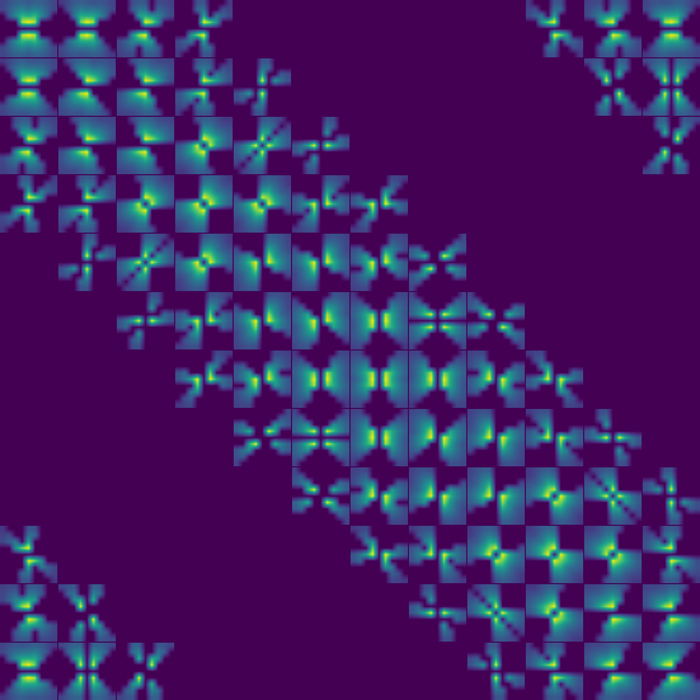

# Bottom-up saliency map layer

Reconstruct the V1 hypothesis - creating a bottom-up saliency map for preattentive selection and segmentation 

**test 1 - layer building W and J**   
W and J connections kernel for K = 12 orientations

J_{m,n,theta,theta'} with i,j = 0...15 and theta' = 0,pi/K pi,...,11/K pi   

W_{m,n,theta,theta'} i,j = 0...15 and theta' = 0,pi/K pi,...,11/K pi   

**test 2 - simple two patterns **
script: t11_test_BotUp_saliency_layer
 config:
 {
  "n_rot": 6,  
  "lamdas": [2],  
  "gamma": 0.5,  
  "phi": [0],  
  "use_octave": true,  
  "octave": 1.6,  
  "per_channel": false,  
  "per_color_channel": false    
}

image_type: half_vert_hori_pattern_small

Simulation run for 32 steps with epsilon=0.1
 
  
Input and Saliency map image
