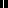
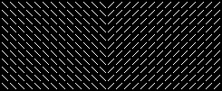
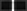

# Bottom-up saliency map layer

Reconstruct the V1 hypothesis - creating a bottom-up saliency map for preattentive selection and segmentation 

**test 1 - layer building W and J**   
W and J connections kernel for K = 12 orientations

J_{m,n,theta,theta'} with i,j = 0...15 and theta' = 0,pi/K pi,...,11/K pi   

W_{m,n,theta,theta'} i,j = 0...15 and theta' = 0,pi/K pi,...,11/K pi   

**test 2 - simple vert line**

script: t11_test_BotUp_saliency_layer
 config:
 {
  "n_rot": 6,  
  "lamdas": [2],  
  "gamma": 0.5,  
  "phi": [0],  
  "use_octave": true,  
  "octave": 1.6,  
  "per_channel": false,  
  "per_color_channel": false    
}

image_type: code_example

bu_saliency = BotUpSaliency((9, 9),   
                            K=n_rot,  
                            steps=200,  
                            epsilon=0.1,  
                            verbose=2)  

 
   
Input and Saliency map image

**test 3 - Figure 5.14F**

script: t11_test_BotUp_saliency_layer
 config:
 {
  "n_rot": 6,  
  "lamdas": [2],  
  "gamma": 0.5,  
  "phi": [0],  
  "use_octave": true,  
  "octave": 1.6,  
  "per_channel": false,  
  "per_color_channel": false    
}

image_type: 'fig5.14F'

bu_saliency = BotUpSaliency((9, 9),   
                            K=n_rot,  
                            steps=200,  
                            epsilon=0.1,  
                            verbose=2)  

 
   
Input and Saliency map image
