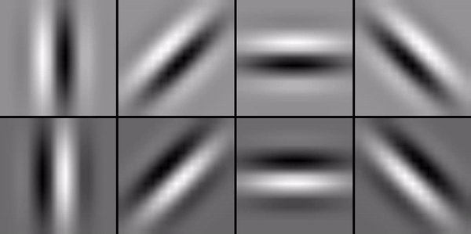

# Dynamic Gabor Filter

**test 1 - First Dynamic gabor filter:**
Size Kernel: (5, 15, 15), sigma_t=2, omega=1, psi=0

Used following config: {
  "n_rot": 4,
  "lamdas": [2],
  "gamma": 0.5,
  "phi": [-0.5, 0.5],
  "use_octave": true,
  "octave": 1.6
}

