# Gabor Filter report results

script: t02_visualize_gabor_activation.py

modify config.json file to reproduce the results

## Texture filters
Gabor filter with:

**test 1:** n_orient = 4, sigma = 1.5, lamda = 1, gamma = 0.5

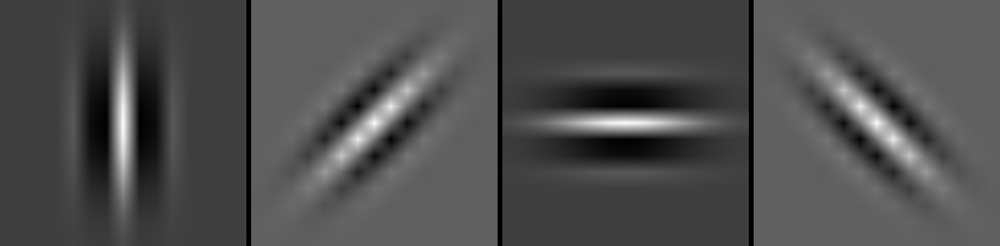
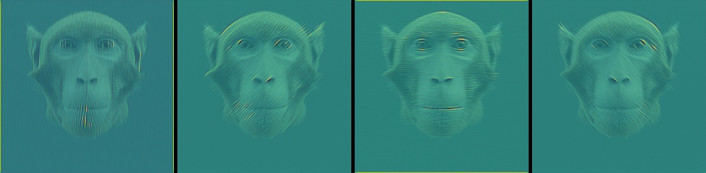
Gabor filters and stimuli with heatmap Gabor Filter activation

**test 2 - sigma effect:** n_orient = 4, sigma = 2, lamda = 1, gamma = 0.5

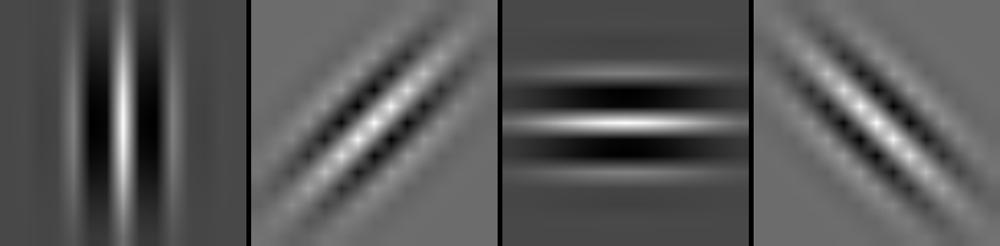
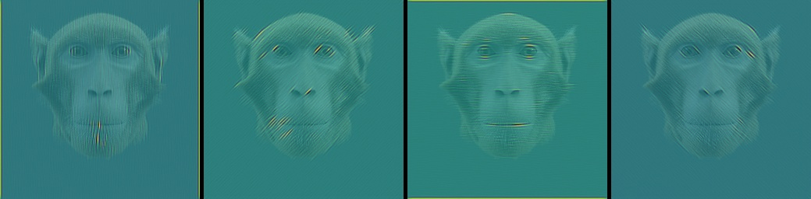
Gabor filters and stimuli with heatmap Gabor Filter activation

**test 3 - sigma effect:** n_orient = 4, sigma = 3, lamda = 1, gamma = 0.5

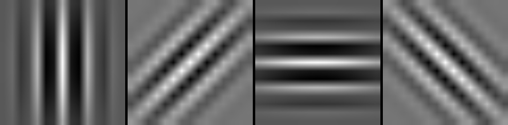
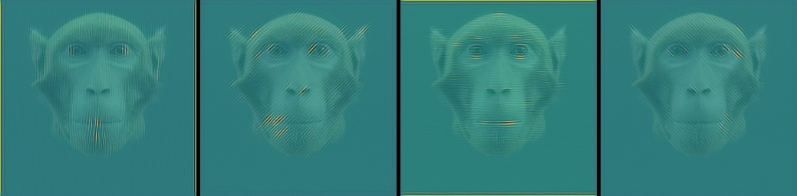
Gabor filters and stimuli with heatmap Gabor Filter activation

**test 4 - sigma effect:** n_orient = 4, sigma = 4, lamda = 1, gamma = 0.5

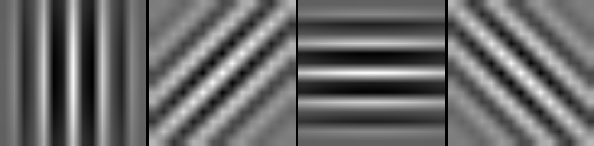
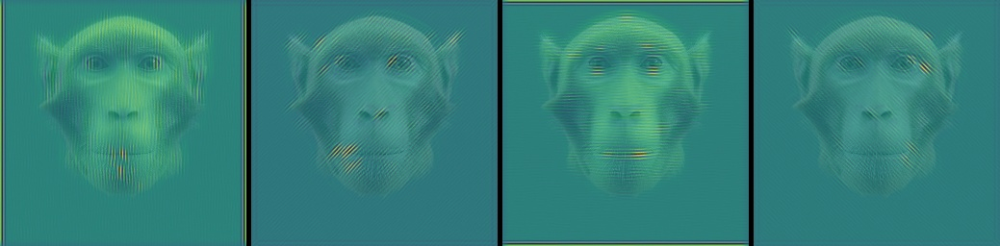
Gabor filters and stimuli with heatmap Gabor Filter activation

**test 5 - gamma effect:** n_orient = 4, sigma = 1.5, lamda = 1, gamma = 1

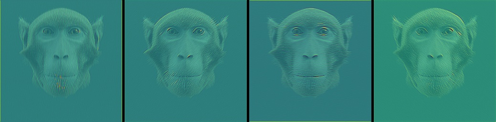
Gabor filters and stimuli with heatmap Gabor Filter activation

**test 6 - lambda effect:** n_orient = 4, sigma = 2, lamda = 1, gamma = 1

Gabor filters and stimuli with heatmap Gabor Filter activation

**test 7 - sigma/lambda effect:** n_orient = 4, sigma = 3, lamda = 2, gamma = 1

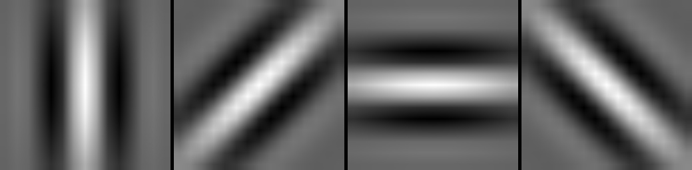
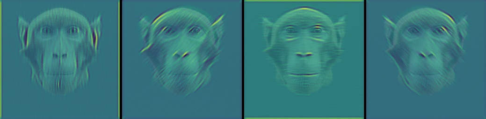
Gabor filters and stimuli with heatmap Gabor Filter activation

**test 7 - sigma/lambda effect:** n_orient = 4, sigma = 3, lamda = 3, gamma = 1

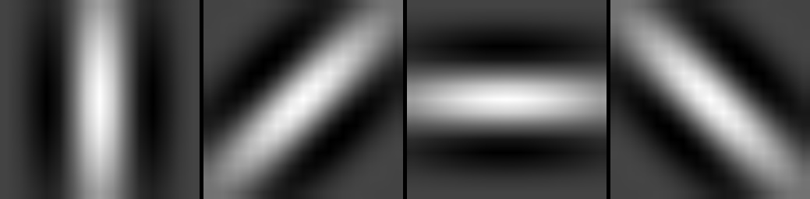
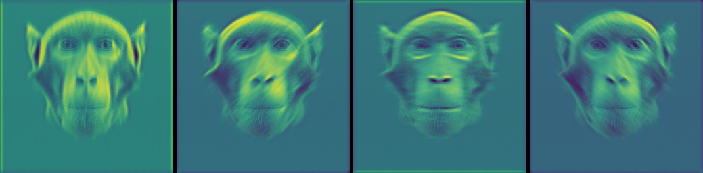
Gabor filters and stimuli with heatmap Gabor Filter activation

**test 8 - sigma/lambda effect:** n_orient = 4, sigma = 4, lamda = 3, gamma = 1

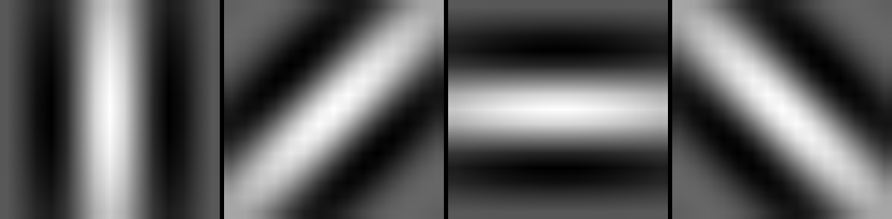
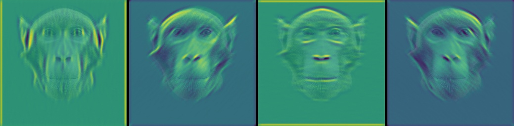
Gabor filters and stimuli with heatmap Gabor Filter activation

## Edge filters
**test 9 - sigma/lambda effect:** n_orient = 4, sigma = 1, lamda = 2.5, gamma = 1, phi = +/- pi/2

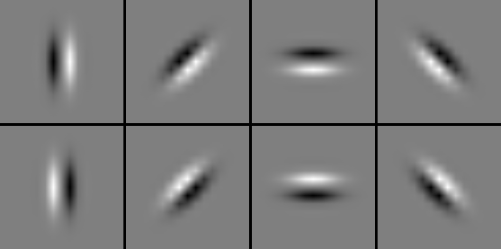
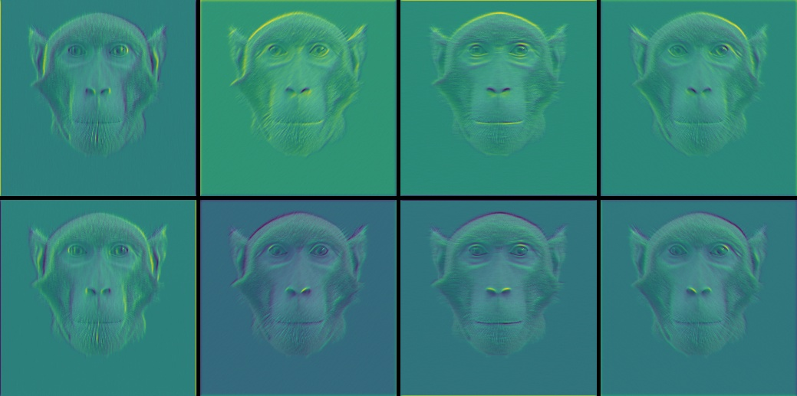
Gabor filters and stimuli with heatmap Gabor Filter activation

**test 10 - sigma/lambda effect:** n_orient = 4, sigma = 2, lamda = 2.5, gamma = 1, phi = +/- pi/2

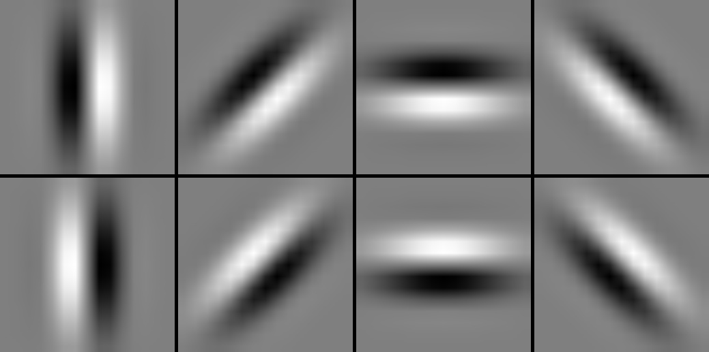
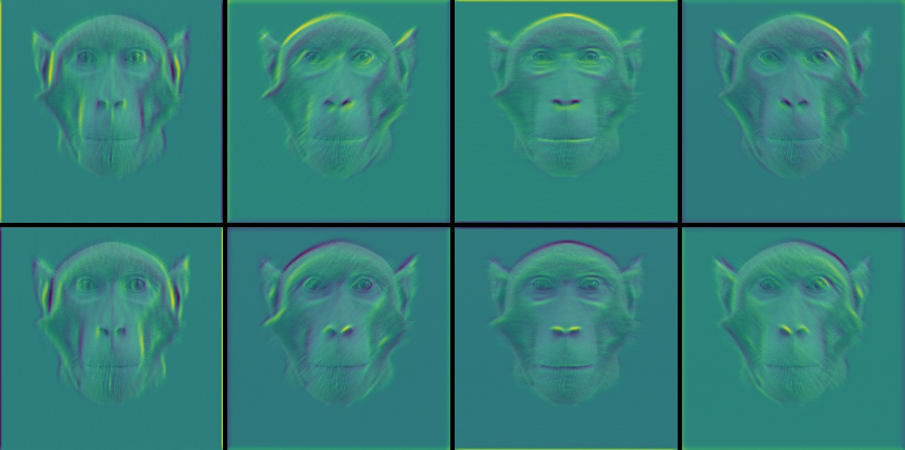
Gabor filters and stimuli with heatmap Gabor Filter activation

**test 11 - sigma/lambda effect:** n_orient = 4, sigma = 3, lamda = 3.5, gamma = 1, phi = +/- pi/2

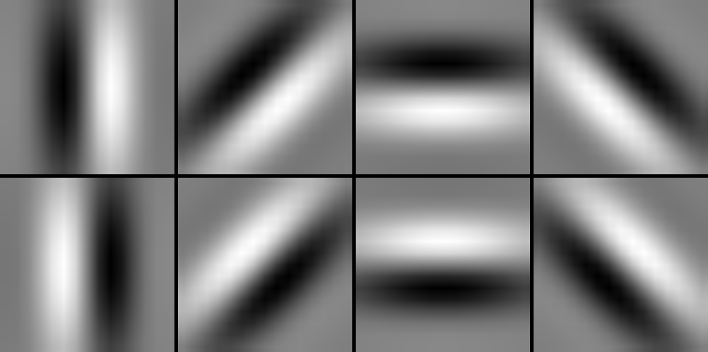
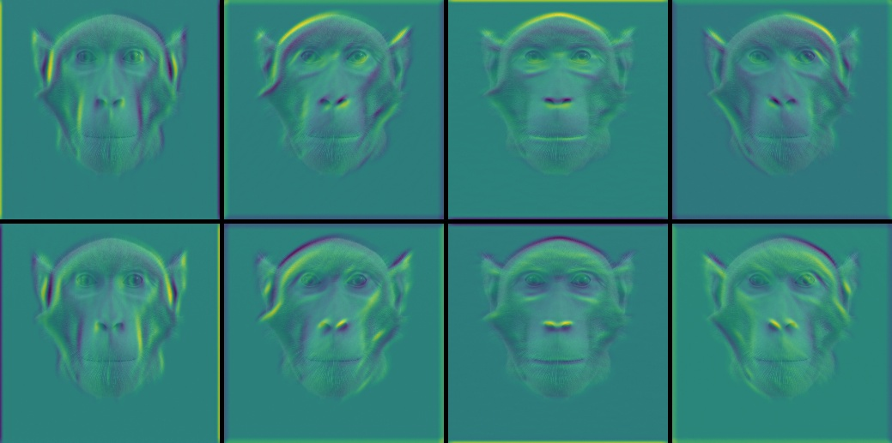
Gabor filters and stimuli with heatmap Gabor Filter activation
