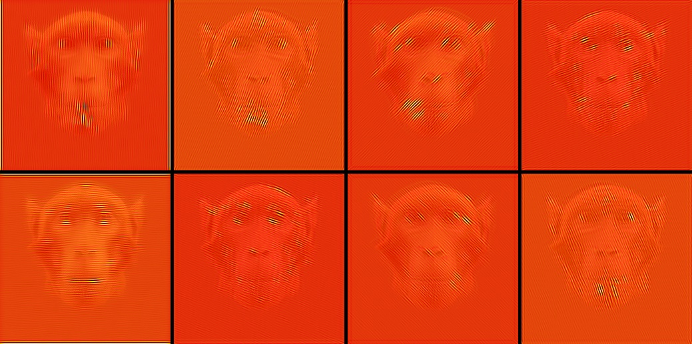
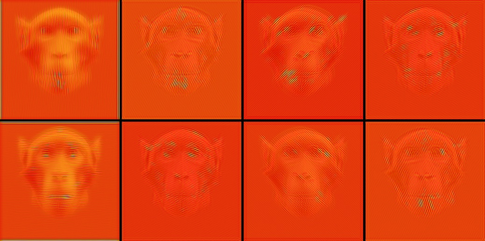
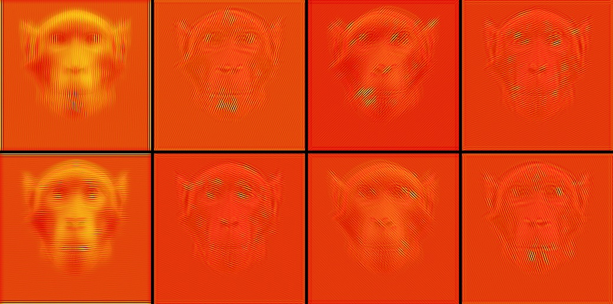
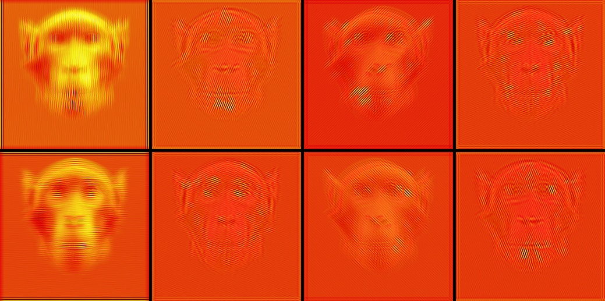
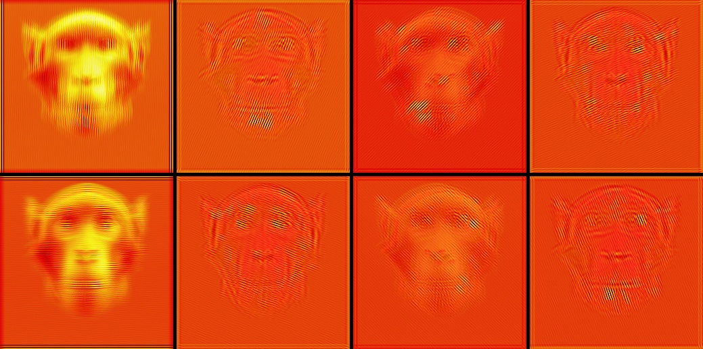

# Gabor Filter report results

script: t02_visualize_gabor_activation.py

modify config.json file to reproduce the results

Gabor filter with:

**test 1:** n_orient = 4, sigma = 1.5, lamdas = 1, gamma = 0.5

Stimuli with heatmap Gabor Filter activation

**test 2:** n_orient = 8, sigma = 3, lamdas = 1, gamma = 0.5

Stimuli with heatmap Gabor Filter activation

**test 3:** n_orient = 8, sigma = 3.5, lamdas = 1, gamma = 0.5

Stimuli with heatmap Gabor Filter activation

**test 4:** n_orient = 8, sigma = 4, lamdas = 1, gamma = 0.5

Stimuli with heatmap Gabor Filter activation

**test 5:** n_orient = 8, sigma = 5, lamdas = 1, gamma = 0.5

Stimuli with heatmap Gabor Filter activation

**test 6:** n_orient = 8, sigma = 6, lamdas = 1, gamma = 0.5

Stimuli with heatmap Gabor Filter activation
