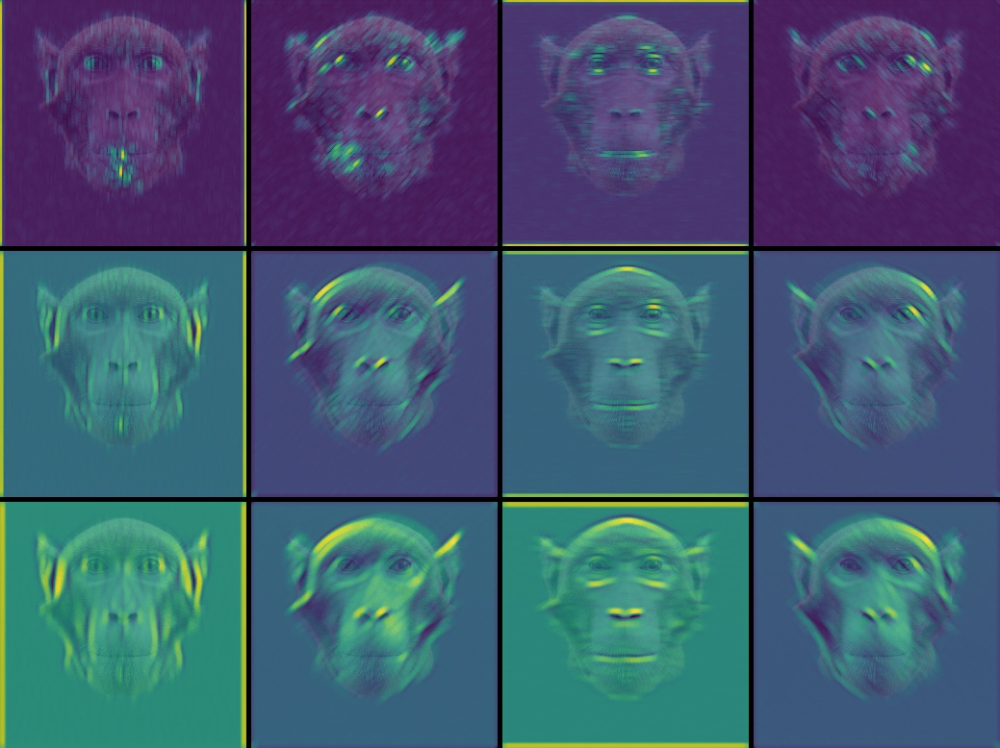
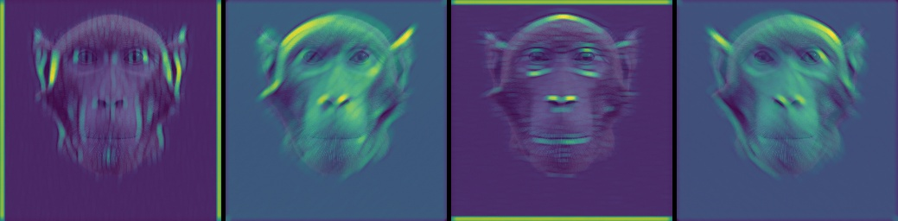
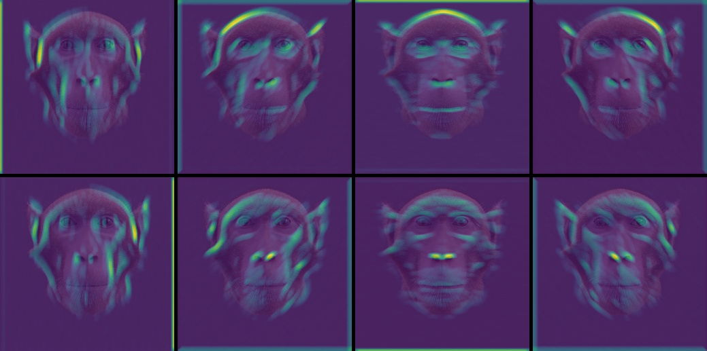

# Max Pooling Depths report results

script t03_test_visualize_max_pool_activation.py

config file: config_test3.json

## Texture filters
**test1 - 2D max pool**
ksize=(3, 3), strides=1, padding='SAME'

heatmap of max pooling activation on 3 different gabor filter type (sigma=2, lambda=1), (sigma=3, lambda=2), (sigma=4, lamda=3)

**test2 - depths max pool**
axis=3, num_cond=3 (ksize=(1, 1), strides=1, padding='SAME')

heatmap of depth max pooling activation on 3 different gabor filter type (sigma=2, lambda=1), (sigma=3, lambda=2), (sigma=4, lamda=3)

**test3 - depths and 2D max pool**
axis=3, num_cond=3, ksize=(3, 3), strides=1, padding='SAME'

heatmap of depth max pooling activation on 3 different gabor filter type (sigma=2, lambda=1), (sigma=3, lambda=2), (sigma=4, lamda=3)

## Edge filters
axis=3, num_cond=3, ksize=(3, 3), strides=1, padding='SAME'

heatmap of depth max pooling activation on 3 different edge gabor filter type (sigma=1, lambda=1.5, phi=+/-pi/2), (sigma=2, lambda=2.5, phi=+/-pi/2), (sigma=3, lamda=3.5, phi=+/-pi/2)
