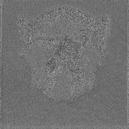
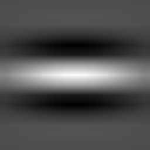
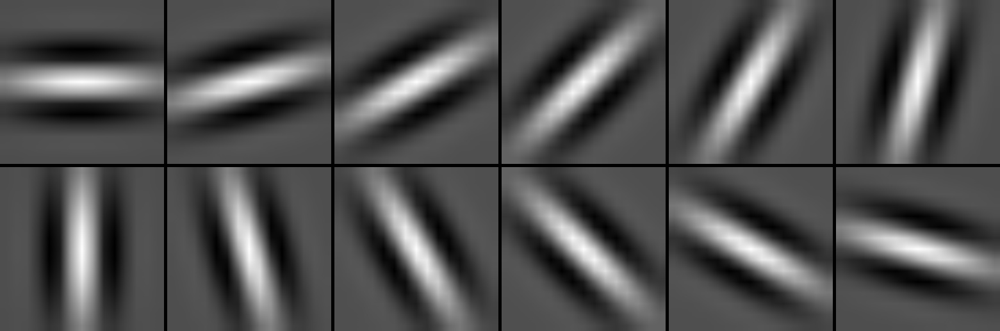
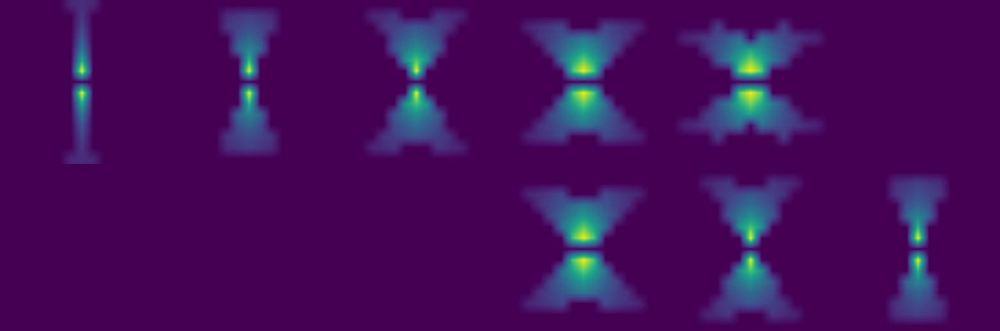

# Saliency Test report results

script: t10_test_feature_saliency.py

**test 1 - Simple Saliency test**

config used: {  
  "n_rot": 6,  
  "lamdas": [2],  
  "gamma": 0.5,  
  "phi": [-0.5, 0.5],  
  "use_octave": true,  
  "octave": 1.6,  
  "per_channel": false,  
  "per_color_channel": true  
}  

Total: 84 filters

Max(x) / Sum(ReLu(x)) / Sum(x)

**test 2 - Inhibition Matrix W**

Graphical computation of inhibitory kernel W_{m,n,theta,i,j,theta'} with m,n the position of the neuron of interest, and i,j the connected neuron (connected neuron -> relative to the neuron of interest, therefore m, n)
config used: {  
  "n_rot": 12,  
  "lamdas": [2],  
  "gamma": 0.5,  
  "phi": [0],  
  "use_octave": true,  
  "octave": 1.6,  
  "per_channel": false,  
  "per_color_channel": false  
}  

Total: 12 filters

Gabor filter of interest (Theta = 0):  

Connected Gabor filters (Theta' = 0,1,...,12)  

W_{m,n,theta,i,j,theta'} with i,j = -7,-6,...7 and theta' = 0,1,...,12. 

