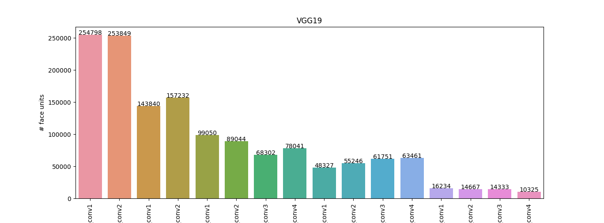

# Face Units

Implement the face selectivity unit as described in the paper "Convolutional neural networks explain tuning properties
of anterior, but not middle, face-processing areas in macaque inferotemporal cortex"

** Procedure **

The FEI dataset can be obtain here: https://fei.edu.br/~cet/facedatabase.html

For the non-face images, I randomly picked 50 images from the "imagenet" dataset.
Then you will need to run the script "create_FEI_csv.py" within the "datasets_utils" folder. Make sure to modify the
configuration file to fit your data path folder.

**test 1 - VGG19 result**

config used:

{
  &nbsp;&nbsp; "model": "VGG19",  
  &nbsp;&nbsp; "include_top": true,  
  &nbsp;&nbsp; "weights": "imagenet",  
  &nbsp;&nbsp; "train_data": "FEI",  
  &nbsp;&nbsp; "orig_img_path":"<...data/FEI/face_images/originalimages>",  
  &nbsp;&nbsp; "front_view": "view_11.mat",  
  &nbsp;&nbsp; "csv": "<...>/data/FEI/FEI_face_units.csv>",  
  &nbsp;&nbsp; "save_path": "models/saved/face_units". 
}
