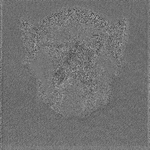

# Saliency Test report results

script: t10_test_feature_saliency.py

**test 1 - Simple Saliency test**

config used: {  
  "n_rot": 6,  
  "lamdas": [2],  
  "gamma": 0.5,  
  "phi": [-0.5, 0.5],  
  "use_octave": true,  
  "octave": 1.6,  
  "per_channel": false,  
  "per_color_channel": true  
}  

Total: 84 filters

Max(x) / Sum(ReLu(x)) / Sum(x)
