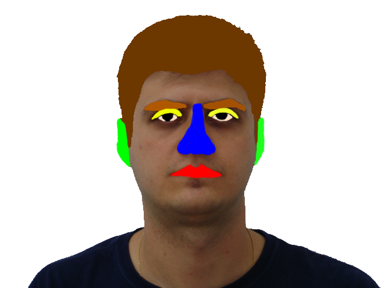
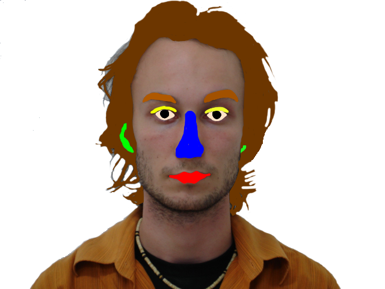
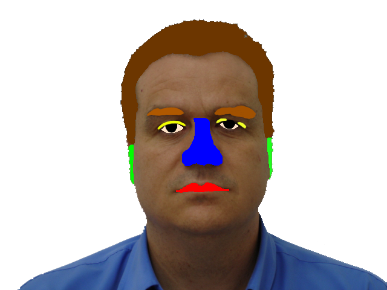
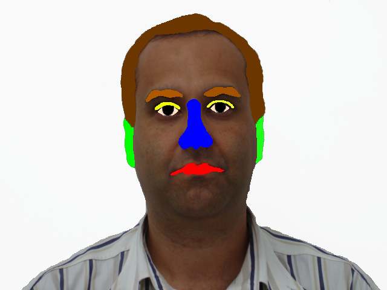

# Semantic Face Parts Units

Implement a face parts semantic based on the methods from "Network Dissection: Quantifying Interpretability of Deep 
Visual Rpresentations" 

The dataset comprise now 15 images form the FEI dataset (https://fei.edu.br/~cet/facedatabase.html) manually 
segmented for the 12 following face parts: 
1. Hair
2. Left_Eyebrow
3. Right_Eyebrow
4. Left_Eyelid
5. Right_Eyelid
6. Eye_pupil
7. Eye_white
8. Nose
9. Mouth
10. Left_Ear
11. Right_ear
12. Teeth

Each of them has a particular color that you can find in the script "create_FEI_segmentation_csv.py" within the 
"datasets_utils" folder". Each face parts is thus segmented into a map by simply segmenting individually each colors. 

**Face Parts segmentation Example**

Example of manual segmented face pats from the FEI dataset (image 1-4). 

**Face Parts Segmented Maps**

Segmentation maps used as label in the implementation