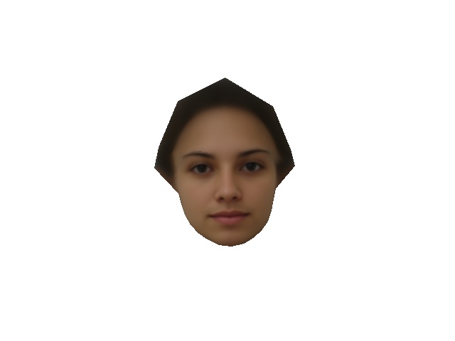
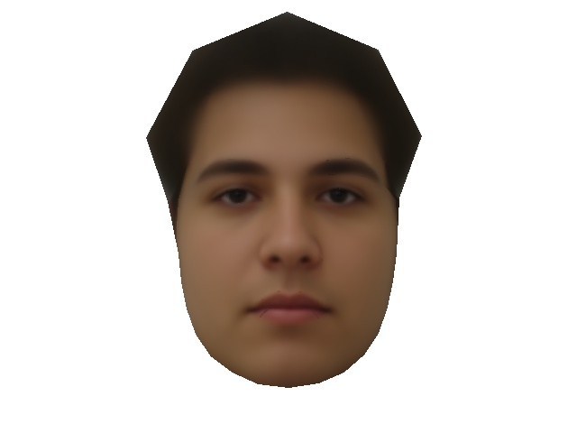
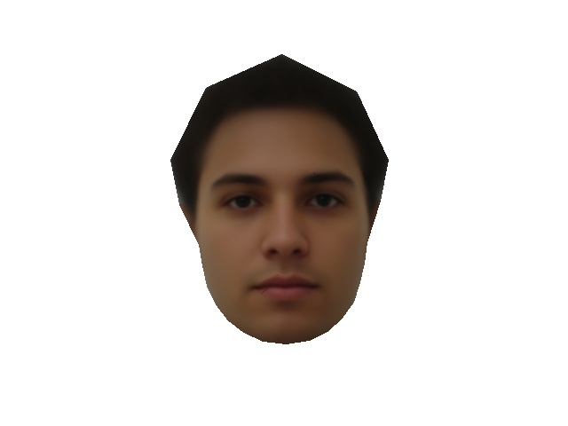
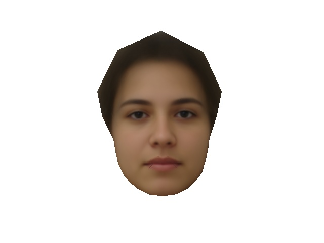
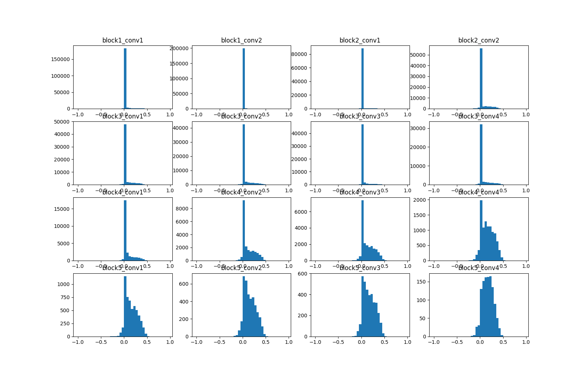

# Shape Appearance Units

Implement the shape appearance selectivity unit as described in the paper "Convolutional neural networks explain tuning
properties of anterior, but not middle, face-processing areas in macaque inferotemporal cortex"

**Procedure**

For this part, you will need to get the facial landmarks which requires to contact Prof. Haruo Hosoya and accept
his terms. Once you have the landmarks, you can run the script "create_FEI_SA_images" within the "dataset_utils" folder.

**test 1 - Shape/Appearance example Fig. 4a**

[-3, 0, 3] 1st shape dimension

[-3, 0, 3] 1st appearance dimension

**test 2 - AM/ ML distribution on VGG19 trained on imagenet**

SPI index distribution of the face units for VGG19

config used:
{  
  &nbsp;&nbsp; "model": "VGG19",  
  &nbsp;&nbsp; "include_top": true,  
  &nbsp;&nbsp; "weights": "imagenet",  
  &nbsp;&nbsp; "train_data": "FEI_SA",  
  &nbsp;&nbsp; "lmk_path":"<...data/FEI/landmark_files>",  
  &nbsp;&nbsp; "orig_img_path":"<...>data/FEI/face_images/originalimages>",  
  &nbsp;&nbsp; "SA_img_path": "<...data/FEI/face_images/shape_appearance_images>",  
  &nbsp;&nbsp; "front_view": "view_11.mat",  
  &nbsp;&nbsp; "csv": "<...>data/FEI/FEI_SA_features.csv>",  
  &nbsp;&nbsp; "face_units_path": "models/saved/face_units",  
  &nbsp;&nbsp; "save_path": "models/saved/SA_units"  
}
