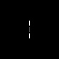

# Bottom-up saliency map layer

Reconstruct the V1 hypothesis - creating a bottom-up saliency map for preattentive selection and segmentation 

**test 1 - layer building W and J**   
W and J connections kernel for K = 12 orientations

J_{m,n,theta,theta'} with i,j = 0...15 and theta' = 0,pi/K pi,...,11/K pi   

W_{m,n,theta,theta'} i,j = 0...15 and theta' = 0,pi/K pi,...,11/K pi   

**test 2 - simple vert line**

script: t11_test_BotUp_saliency_layer
 config:  
 {  
    &nbsp;&nbsp;&nbsp;&nbsp;&nbsp;&nbsp; "n_rot": 12,  
    &nbsp;&nbsp;&nbsp;&nbsp;&nbsp;&nbsp; "lamdas": [2],  
    &nbsp;&nbsp;&nbsp;&nbsp;&nbsp;&nbsp; "gamma": 0.5,  
    &nbsp;&nbsp;&nbsp;&nbsp;&nbsp;&nbsp; "phi": [0],  
    &nbsp;&nbsp;&nbsp;&nbsp;&nbsp;&nbsp; "use_octave": true,  
    &nbsp;&nbsp;&nbsp;&nbsp;&nbsp;&nbsp; "octave": 1.6,  
    &nbsp;&nbsp;&nbsp;&nbsp;&nbsp;&nbsp; "per_channel": false,  
    &nbsp;&nbsp;&nbsp;&nbsp;&nbsp;&nbsp; "per_color_channel": false    
}  

image_type: code_example

bu_saliency = BotUpSaliency((9, 9),   
&nbsp;&nbsp;&nbsp;&nbsp;&nbsp;&nbsp;&nbsp;&nbsp;&nbsp;&nbsp;&nbsp;&nbsp; K=n_rot,  
&nbsp;&nbsp;&nbsp;&nbsp;&nbsp;&nbsp;&nbsp;&nbsp;&nbsp;&nbsp;&nbsp;&nbsp; steps=200,  
&nbsp;&nbsp;&nbsp;&nbsp;&nbsp;&nbsp;&nbsp;&nbsp;&nbsp;&nbsp;&nbsp;&nbsp; epsilon=0.1,  
&nbsp;&nbsp;&nbsp;&nbsp;&nbsp;&nbsp;&nbsp;&nbsp;&nbsp;&nbsp;&nbsp;&nbsp; verbose=2)  

 
   
Input and Saliency map image

**test 3 - Figure 5.14F**

script: t11_test_BotUp_saliency_layer  
config: same as test 2

image_type: 'fig5.14F'

 
   
Input and Saliency map image

**test 4 - Figure 5.18A**

script: t11_test_BotUp_saliency_layer  
config: same as test2  

image_type: 'fig_5.18A'
 
   
Input and Saliency map image

**test 5 - Figure 5.18B**

script: t11_test_BotUp_saliency_layer  
config: same as test2 

image_type: 'fig_5.18B'
 
   
Input and Saliency map image

**test 6 - Figure 5.18D**

script: t11_test_BotUp_saliency_layer  
config: same as test2

image_type: 'fig_5.18D'
 
   
Input and Saliency map image

**test 7 - Figure 5.18G**

script: t11_test_BotUp_saliency_layer  
config: same as test2 

image_type: 'fig_5.18G'
 
   
Input and Saliency map image
